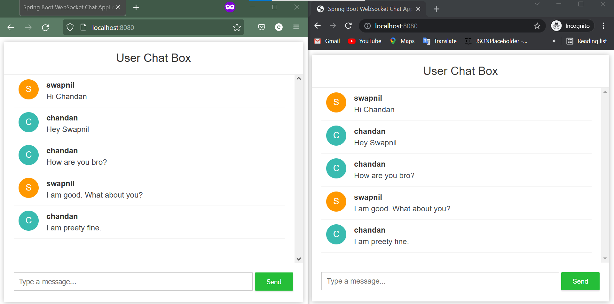

# KafkaChattingApp

A POC project on Kafka application to build a group chatting application


First get into your Kafka directory and execute these commands in different terminals.


Zookeeper command

```bash
.\bin\windows\zookeeper-server-start.bat .\config\zookeeper.properties
```

Kafka command

```bash
.\bin\windows\kafka-server-start.bat .\config\server.properties
```

Create topic

```bash
./kafka-topics.bat --zookeeper localhost:2181 --create --topic mykafkatopic --partitions 1 --replication-factor 1
```

Now run the application


**Output**


